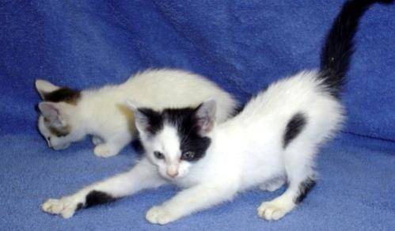
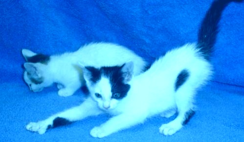
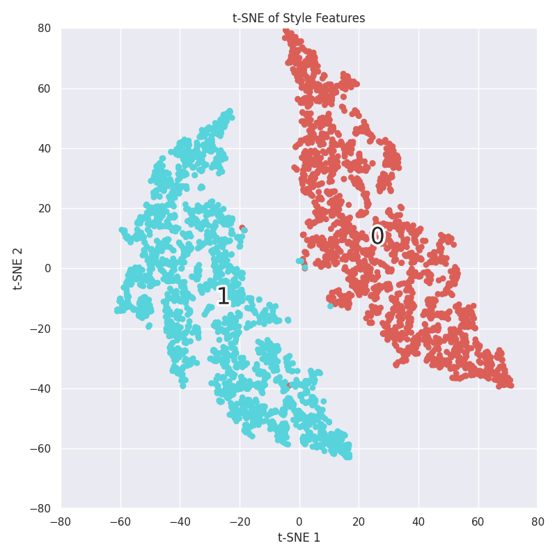
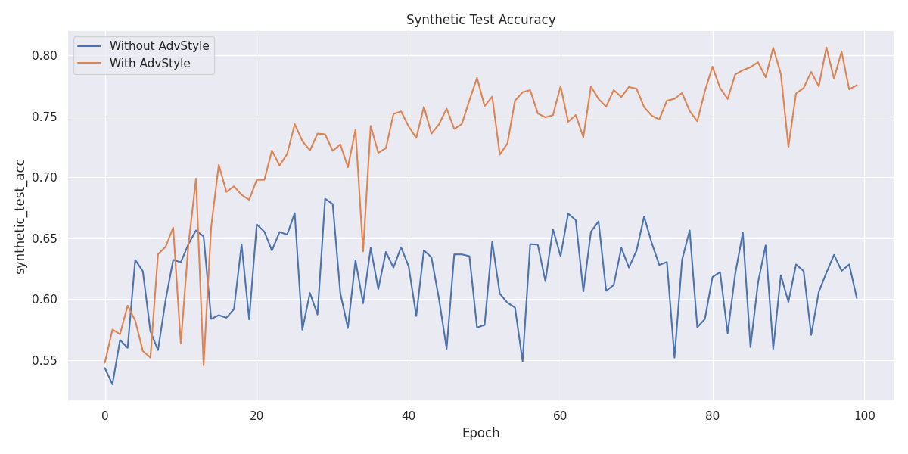

# Adversarial Style for Image Classification

[](https://github.com/harisankar95/AdvStyle/actions/workflows/pylint.yml)

## Introduction

This project is an implementation of the paper "Adversarial Style Augmentation for Domain Generalized Urban-Scene Segmentation"[[1](https://arxiv.org/abs/2207.04892)] by Z. Zhong et al. The paper proposes a method to improve the performance of a model on unseen real domains by adversarially augmenting the style of the input images. The method is based on the observation that the style of the images can largely influence the model's performance and that the style features can be well represented by the channel-wise mean and standard deviation of the images. The proposed method, called Adversarial Style Augmentation (AdvStyle), regards the style feature as a learnable parameter and updates it by adversarial training. The paper demonstrates that AdvStyle can significantly improve the model performance on unseen real domains for semantic segmentation.

Here, we apply the method to the task of image classification and evaluate its performance kaggel's on "Dogs vs. Cats" dataset[[2](https://www.kaggle.com/datasets/tongpython/cat-and-dog/data)]. We create a synthetic test set by applying the style augmentation to the original test set and compare the performance of the model on the original and synthetic test sets.

## Getting Started

### Prerequisites

The code is implemented in Python and requires the following packages:

- PyTorch
- torchvision
- tqdm
- matplotlib
- seaborn

### Installation

To install the required packages, run the following command:

```bash

pip install -r requirements.txt

```

### Usage

1. Download the "Dogs vs. Cats" dataset from kaggle[[2](https://www.kaggle.com/datasets/tongpython/cat-and-dog/data)] and extract the files to the `data` directory. The directory should have the following structure:

    ```plaintext

    data
    ├── training_set
    │   ├── cats
    │   │   ├── cat.1.jpg
    │   │   ├── cat.2.jpg
    │   │   └── ...
    │   └── dogs
    │       ├── dog.1.jpg
    │       ├── dog.2.jpg
    │       └── ...
    └── test_set
        ├── cats
        │   ├── cat.4001.jpg
        │   ├── cat.4002.jpg
        │   └── ...
        └── dogs
            ├── dog.4001.jpg
            ├── dog.4002.jpg
            └── ...

    ```

1. Generate synthetic test sets by running the following command:

    ```bash

    python3 generate_synthetic_test_set.py

    ```

    This will create synthetic test sets with different style features and save them to the `data/synthetic_test_set` directory.
    Below one can see an example image from the original test set and its synthetic test set with different style features.

    <div align="center">
        <figure style="display: inline-block; text-align: center;">
            
            <p>Test Set</p>
        </figure>
        <figure style="display: inline-block; text-align: center;">
            
            <p>Synthetic Test Set</p>
        </figure>
    </div>

1. From the above, one can see that the synthetic test set has different style features from the original test set. This is also evident from the t-SNE visualization of the feature representations of the original and synthetic test sets. 0 and 1 represent the original and synthetic test sets, respectively.

    <div align="center">
        
    </div>

1. Train the models by running the following command:

    ```bash

    python3 train.py

    ```

    This will train the models with and without the style augmentation and save the plots to the `results` directory.

    The train step can be visualized with the following flowchart:

    ```mermaid
    graph TD
        B[Input Images]
        B --> C{Normalize Images}
        C -->|Detach| D[Normalized Images]
        D --> E[Create Adversarial Style Features]
        E --> F[Optimize Adversarial Features]
        F --> G[Generate Adversarial Inputs]
        G --> H[Train Classifier Network with Original and Adversarial Inputs]
        H --> I[Concatenate Inputs and Ground Truth]
        I --> J[Compute Loss]
        J --> K[Backpropagate]
        K --> L[Update Network Weights]
    ```

## Results

The following plots show the performance of the models with and without the style augmentation on the synthetic test set.

<div align="center">
    <figure style="display: inline-block; text-align: center;">
        
        <p>Accuracy</p>
    </figure>
</div>

The results show that the model with the adversarial style augmentation performs better on the synthetic test set than the model without the style augmentation thus demonstrating the effectiveness of the proposed method in improving the model's performance on unseen domains with different style features.

## References

1. Zhun Zhong and Yuyang Zhao and Gim Hee Lee and Nicu Sebe, "Adversarial Style Augmentation for Domain Generalized Urban-Scene Segmentation", arXiv preprint arXiv:2207.04892, 2022.
2. "Dogs vs. Cats," Kaggle, 2022. [Online]. Available: <https://www.kaggle.com/datasets/tongpython/cat-and-dog/data>. [Accessed: 22- Feb- 2024].
